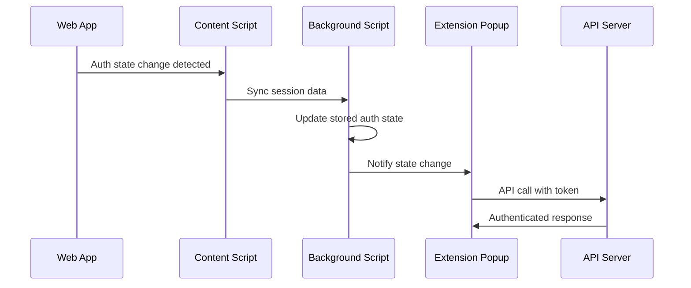

# Authentication Synchronization Between Web App and Browser Extension

This guide explains the comprehensive authentication synchronization system implemented between your Next.js web application and WXT browser extension using Better Auth.

## 🎯 Overview

The system provides seamless authentication synchronization between your web app and browser extension, ensuring users stay logged in across both environments with automatic token management and secure cross-context communication.

## 🏗️ Architecture

### Core Components

1. **AuthManager** (`apps/extension/src/lib/auth-manager.ts`)
   - Centralized authentication state management
   - Handles login, registration, logout, and token refresh
   - Manages secure storage of authentication data
   - Provides singleton pattern for consistent state across extension

2. **Background Script** (`apps/extension/src/entrypoints/background.ts`)
   - Coordinates authentication across all extension contexts
   - Handles message passing between popup, content scripts, and background
   - Performs periodic session validation (every 5 minutes)
   - Manages cross-context state synchronization

3. **Content Script** (`apps/extension/src/entrypoints/content/auth-sync.ts`)
   - Monitors web app authentication state changes
   - Extracts session data from web app and syncs with extension
   - Listens for DOM changes, storage events, and custom auth events
   - Provides fallback periodic sync (every 30 seconds)

4. **Auth Hook** (`apps/extension/src/hooks/use-auth.ts`)
   - React hook for easy authentication in extension components
   - Provides reactive authentication state
   - Handles loading states and error management
   - Simplifies auth operations in UI components

5. **Enhanced tRPC Client** (`apps/extension/src/lib/trpc-chrome-client.ts`)
   - Automatically includes authentication tokens in API requests
   - Handles 401 responses with automatic token refresh
   - Provides retry logic for failed authenticated requests
   - Manages CORS and credential handling for extension context

## 🔧 Implementation Details

### Authentication Flow



### File Structure

```
apps/extension/src/
├── lib/
│   ├── auth-client.ts          # Auth client configuration & storage helpers
│   ├── auth-manager.ts         # Core authentication management
│   └── trpc-chrome-client.ts   # Enhanced tRPC client with auth
├── hooks/
│   └── use-auth.ts            # React hook for authentication
├── entrypoints/
│   ├── background.ts          # Background script for coordination
│   ├── popup/App.tsx          # Updated popup with auth UI
│   └── content/
│       └── auth-sync.ts       # Web-extension sync content script
└── ...

apps/web/src/lib/
└── extension-sync.ts          # Helper for web app integration

apps/server/src/lib/
└── context.ts                 # Enhanced to support token auth
```

## 🚀 Usage Guide

### 1. Extension Popup Authentication

The extension popup now provides a complete authentication interface:

```typescript
// The popup automatically uses the useAuth hook
import { useAuth } from '../../hooks/use-auth';

function MyComponent() {
  const { 
    authState, 
    isLoading, 
    login, 
    register, 
    logout, 
    isAuthenticated 
  } = useAuth();

  // Authentication state is automatically managed
  if (isAuthenticated) {
    return <div>Welcome {authState.user?.email}!</div>;
  }

  return <LoginForm onLogin={login} />;
}
```

### 2. Making Authenticated API Calls

The tRPC client automatically handles authentication:

```typescript
import { trpc } from '../lib/trpc-chrome-client';

// Tokens are automatically included in requests
const userData = await trpc.userData.query();

// 401 responses trigger automatic token refresh and retry
const enhancedPrompts = await trpc.enhancePrompts.mutate({
  prompt: "Make this better"
});
```

### 3. Web App Integration

In your web app, notify the extension of authentication changes:

```typescript
import { notifyExtensionAuthChange } from '../lib/extension-sync';
import { authClient } from '../lib/auth-client';

// After successful login in web app
const session = await authClient.signIn.email({ email, password });
if (session.data) {
  notifyExtensionAuthChange(session.data);
}

// After logout in web app
await authClient.signOut();
notifyExtensionAuthChange(null);
```

### 4. Content Script Integration

The content script automatically detects authentication changes in your web app through multiple methods:

- **Storage Events**: Monitors localStorage/sessionStorage changes
- **Custom Events**: Listens for `auth-state-changed` events
- **DOM Observation**: Watches for auth-related DOM changes
- **Periodic Sync**: Fallback sync every 30 seconds
- **Global Variables**: Checks `window.__BETTER_AUTH_SESSION__`

## 🔒 Security Features

### Token Management
- **Secure Storage**: Tokens stored in browser extension storage (isolated from web pages)
- **Automatic Refresh**: Tokens refreshed before expiration (1-minute buffer)
- **Retry Logic**: Failed requests automatically retry with refreshed tokens
- **Cleanup**: Tokens cleared on logout or authentication failure

### Cross-Origin Security
- **CORS Configuration**: Proper CORS handling for extension-server communication
- **Credential Isolation**: Extension uses token-based auth, web app uses cookies
- **Permission Management**: Minimal required permissions in manifest

### Data Protection
- **No PII Exposure**: Sensitive data never exposed to content scripts
- **Encrypted Storage**: Browser extension storage provides encryption
- **Session Validation**: Regular session validation prevents stale tokens

## ⚙️ Configuration

### 1. Update Domain Configuration

Replace placeholder domains in these files:

**Content Script** (`apps/extension/src/entrypoints/content/auth-sync.ts`):
```typescript
matches: [
  'http://localhost:3001/*', // Development
  'https://your-actual-domain.com/*', // Replace with your domain
],
```

**WXT Config** (`apps/extension/wxt.config.ts`):
```typescript
host_permissions: [
  "http://localhost:3000/*", // Development server
  "http://localhost:3001/*", // Development web app
  "https://your-actual-domain.com/*", // Replace with your domain
],
```

### 2. Environment Variables

Ensure these environment variables are set:

```bash
# Extension (.env)
VITE_SERVER_URL=http://localhost:3000  # Development
# VITE_SERVER_URL=https://api.your-domain.com  # Production

# Web App (.env.local)
NEXT_PUBLIC_SERVER_URL=http://localhost:3000  # Development
# NEXT_PUBLIC_SERVER_URL=https://api.your-domain.com  # Production

# Server (.env)
BETTER_AUTH_SECRET=your-secret-key
BETTER_AUTH_URL=http://localhost:3000  # Development
# BETTER_AUTH_URL=https://api.your-domain.com  # Production
CORS_ORIGIN=http://localhost:3001  # Development web app
```

### 3. Better Auth Configuration

Your server already has Better Auth configured. The system now supports both:
- **Cookie-based authentication** (for web app)
- **Token-based authentication** (for extension)

## 🧪 Testing the Integration

### 1. Development Setup

```bash
# Start all services
bun dev

# Or start individually
bun dev:server  # Port 3000
bun dev:web     # Port 3001
bun dev:extension  # Extension development mode
```

### 2. Test Authentication Flow

1. **Web App Login**:
   - Go to `http://localhost:3001/login`
   - Sign in with your credentials
   - Extension should automatically sync the session

2. **Extension Login**:
   - Open extension popup
   - Sign in with credentials
   - Should work independently of web app

3. **Cross-Sync Verification**:
   - Login in web app, check extension popup shows authenticated state
   - Login in extension, refresh web app to see synced state
   - Logout from either, verify both are logged out

### 3. API Testing

Test authenticated API calls from extension:

```typescript
// In extension popup or content script
import { trpc } from '../lib/trpc-chrome-client';

// This should work if authenticated
const result = await trpc.userData.query();
console.log('User data:', result);
```

## 🐛 Troubleshooting

### Common Issues

1. **Extension not syncing with web app**:
   - Check browser console for content script errors
   - Verify domain matches in content script configuration
   - Ensure web app is dispatching auth events

2. **API calls returning 401**:
   - Check if tokens are being stored correctly
   - Verify server context is handling Bearer tokens
   - Check network tab for request headers

3. **Extension popup not showing auth state**:
   - Check background script console for errors
   - Verify storage permissions in manifest
   - Test message passing between contexts

### Debug Tools

1. **Extension Storage**:
   ```javascript
   // In extension console
   browser.storage.local.get().then(console.log);
   ```

2. **Auth State**:
   ```javascript
   // In extension popup console
   browser.runtime.sendMessage({ type: 'GET_AUTH_STATE' }).then(console.log);
   ```

3. **Server Health**:
   ```javascript
   // Test server connectivity
   fetch('http://localhost:3000/health').then(r => r.json()).then(console.log);
   ```

## 🔄 Advanced Features

### Custom Authentication Events

You can extend the system with custom events:

```typescript
// In web app
window.dispatchEvent(new CustomEvent('custom-auth-event', {
  detail: { customData: 'value' }
}));

// In content script
window.addEventListener('custom-auth-event', (event) => {
  // Handle custom auth logic
});
```

### Additional Storage

Extend auth state with custom data:

```typescript
// In auth-manager.ts
interface ExtendedAuthState extends AuthState {
  customField?: string;
  preferences?: UserPreferences;
}
```

### Background Sync Customization

Modify sync intervals in background script:

```typescript
// Change from 5 minutes to custom interval
setInterval(async () => {
  // Custom sync logic
}, 2 * 60 * 1000); // 2 minutes
```

## 📝 Next Steps

1. **Production Deployment**:
   - Update all domain references to production URLs
   - Configure production environment variables
   - Test with production Better Auth setup

2. **Enhanced Security**:
   - Implement refresh token rotation
   - Add token encryption for extra security
   - Set up monitoring for auth failures

3. **User Experience**:
   - Add loading states for auth operations
   - Implement better error messages
   - Add offline auth state handling

4. **Monitoring**:
   - Add analytics for auth events
   - Monitor sync success rates
   - Track token refresh patterns

## 🤝 Support

If you encounter issues:

1. Check the browser console for errors
2. Verify environment variables are set correctly
3. Test each component individually
4. Check network requests in developer tools
5. Verify Better Auth server configuration

The system is designed to be robust and handle edge cases, but proper configuration is essential for smooth operation.